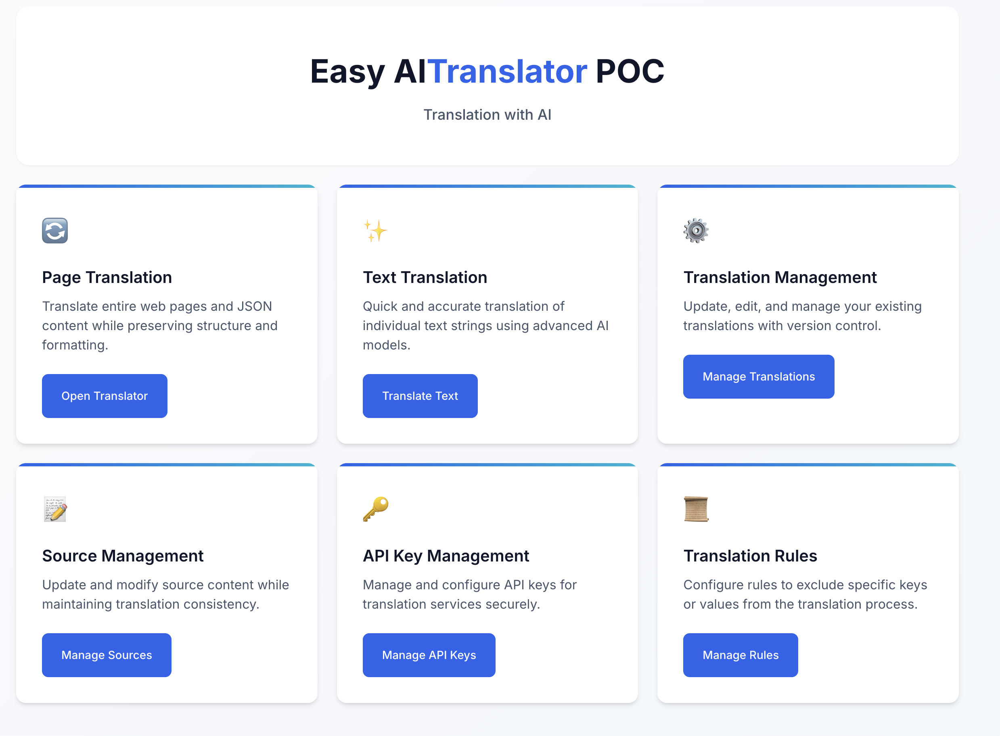
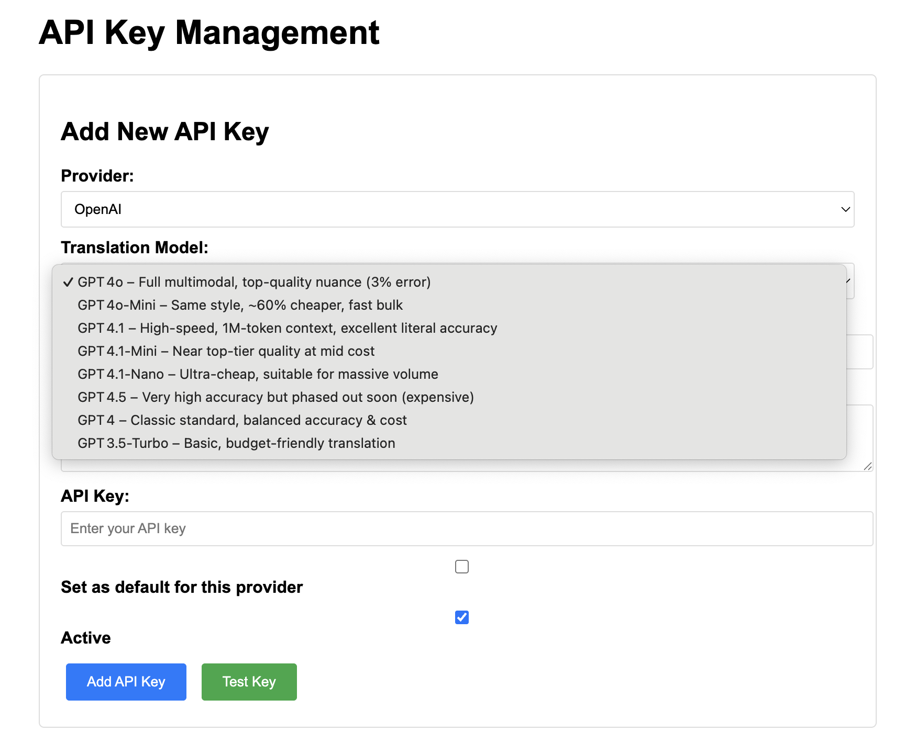
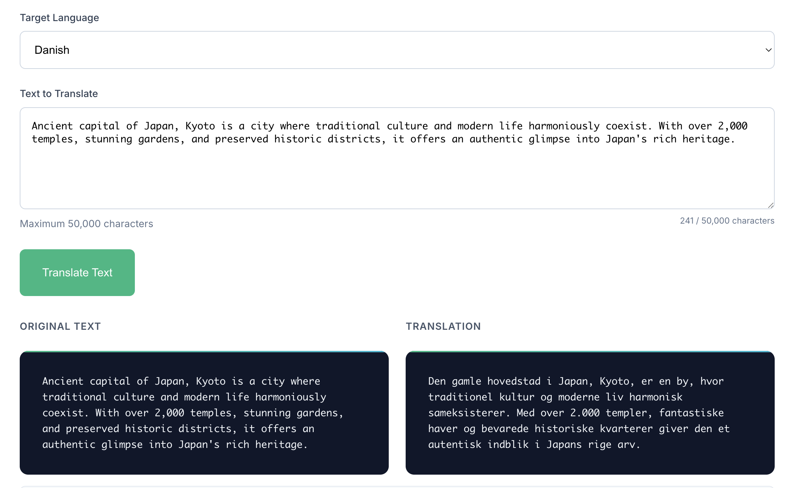
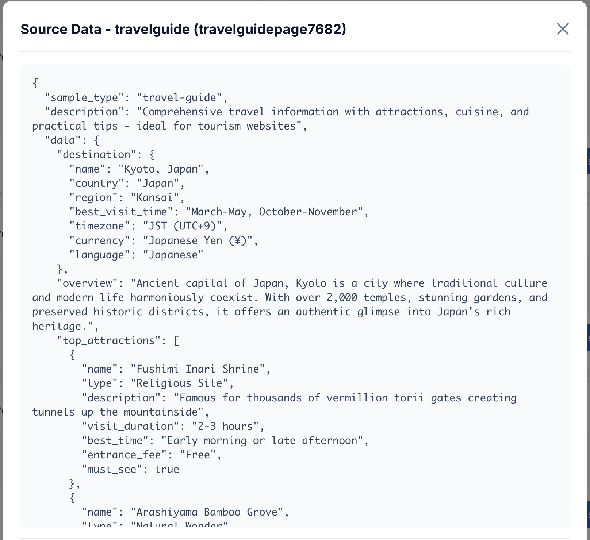
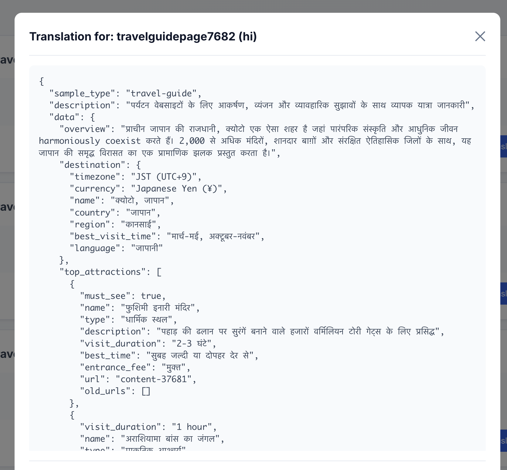
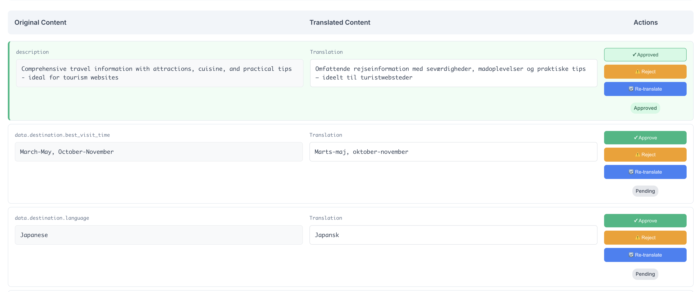
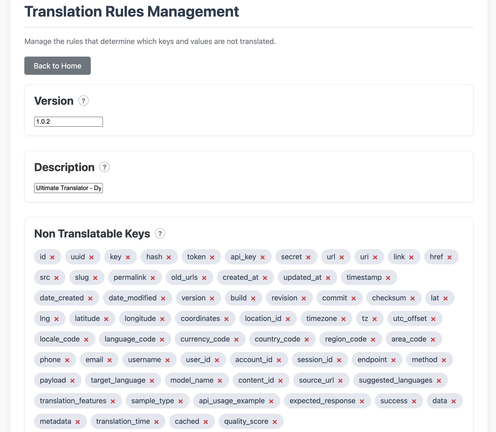

# Easy AI Translator

## Overview

**Easy AI Translator** is a comprehensive web-based translation service that can translate web content, individual strings, and entire JSON structures. It supports multiple translation providers including Google Translate, OpenAI (tested), and HuggingFace models, making it a flexible solution for various translation needs.

## Prerequisites

- **Node.js** (v14 or higher)
- **MongoDB** (v4.4 or higher)
- **Docker & Docker Compose** (for containerized deployment)

## Installation & Setup

### 1. Environment Configuration

Create a `.env` file in the root directory:

```env
# Database
MONGODB_URI=mongodb://localhost:27017/ultimate-translator

# Default Translation Provider
DEFAULT_TRANSLATOR=huggingface  # Options: google, openai, huggingface

# OpenAI Configuration (if using OpenAI)
OPENAI_API_KEY=your_openai_api_key_here

# HuggingFace Configuration (if using HuggingFace)
HUGGINGFACE_API_URL=http://localhost:5000
```

### 2. Using Docker (Recommended)

```bash
# Clone the repository
git clone <repository-url>
cd Ultimate-Translator

# Copy environment file and configure
cp .env.example .env
# Edit .env file with your configuration

# Start all services
docker-compose -f docker-compose.dev.yml up -d --build

# The application will be available at:
# - Main App: http://localhost:3000 (or your configured PORT)
# - MongoDB: mongodb://localhost:27017

# View logs
docker-compose logs -f app

# Stop services
docker-compose down
```

### 3. Manual Installation

```bash
# Install dependencies
npm install

# Copy environment file and configure
cp .env.example .env
# Edit .env file with your configuration

# Start MongoDB (ensure MongoDB is running)
# mongod

# Start the application
npm start

# For development with auto-restart
npm run dev
```

## 🚀 Unleash the Power of Easy AI Translator

Welcome to Easy AI Translator! You've set up a powerful, enterprise-grade translation service. Here's how to get started and experience its full potential.

### Your Quick Start Guide

#### 1. Power Up Your Translation Engines
Before you can translate, connect your favorite providers. Easy AI Translator puts you in control.

- **Navigate to the UI**: Open your browser to `http://localhost:3000/`.
- **Add API Keys**: Go to the "API Key Management" section. Here, you can securely add and encrypt keys for **Google Translate**, **OpenAI (GPT)**, or even your own self-hosted **HuggingFace** models for maximum privacy and control.
- **Set a Default**: Choose one key as your default for quick, everyday translations.



#### 2. Translate Anything, Instantly
Easy AI Translator is built to handle any translation task, from a single word to complex, structured data.

- **Simple Text Translation**: Start with the "Text Translation" tool to test your setup. It's a great way to see the speed and quality of your chosen provider.



- **Full Web Page Translation**: Drop any URL into the "Page Translation" service and watch as Easy AI Translator renders a fully translated version in real-time.
- **Intelligent JSON Translation**: For developers, this is where the magic happens. Translate complex JSON objects without corrupting your data. Our intelligent engine automatically detects and preserves keys, IDs, URLs, and other non-translatable elements, ensuring your data structure remains intact. Explore the `/api/v1/sample/{type}` endpoint to see this in action with sample e-commerce or technical data.

Here's an example of how the translator handles complex JSON, preserving the structure and only translating the values:

**Source Language (English):**


**Translated to Destination Language (e.g., hindi):**


#### 3. Manage and Scale with Confidence
Keep track of your work and rely on a system built for performance.

- **Translation Management**: Visit the "Translation Management" dashboard to view, manage, and revisit all your previously translated pages.



- **Built for Scale**: Behind the scenes, the system is optimized with caching, circuit breakers, and automatic provider fallbacks to ensure reliability and performance, even when external services are slow.

### For Developers: A Powerful API Awaits

Easy AI Translator is more than a UI; it's a developer-first platform.

- **Explore the API**: Head to `http://localhost:3000/api-docs` to access the interactive Swagger UI. Discover all available endpoints for programmatic translation, configuration, and management.
- **Integrate with Ease**: Build powerful, multilingual applications by leveraging a robust, secure, and well-documented API.

## Why Easy AI Translator? The Solution for Complex, Large-Scale Translation

Managing translations when your content is vast, complex, and constantly changing is a nightmare. Translating backend data for frontend applications, especially unstructured or nested JSON, often leads to corrupted data, broken user experiences, and immense manual effort.

**Easy AI Translator is built to solve this.** It automates and manages bulk translations for any data structure, adapting to your content with unparalleled intelligence and configurability.

### Key Differentiators: The "Hidden" Features

Beyond simple string-for-string translation, Easy AI Translator provides an enterprise-grade engine packed with features that ensure quality, reliability, and cost-effectiveness.

- **Intelligent Content-Aware Translation**: The system automatically detects and preserves non-translatable elements.
    - It intelligently skips over IDs, slugs, URLs, currency values, and code snippets, preventing data corruption.
    - Based on a comprehensive set of rules (`translation-rules.json`) that you can customize and extend.



- **Adaptive & Learning Engine**: For SaaS products with diverse customer needs, the system can be configured to learn from your data patterns, continuously improving its accuracy and reducing the need for manual oversight.

- **Unmatched Reliability with Automatic Fallbacks**: Never let a provider outage impact your service.
    - **Circuit Breaker Pattern**: If a translation provider (like OpenAI) becomes unresponsive, the system instantly trips a circuit breaker to prevent cascading failures.
    - **Provider Failover**: It then automatically reroutes the request to your next preferred provider (e.g., Google or HuggingFace), ensuring the translation still succeeds.

- **Performance and Cost Optimization**:
    - **Smart Caching**: Repeated translations don't hit your API budget. The first translation is cached, making subsequent requests instantaneous and free.
    - **Optimized Architecture**: With response compression, efficient database pooling, and performance monitoring, the system is built for high-throughput scenarios.

- **Total Provider Flexibility & Security**:
    - **Multi-Provider Support**: Avoid vendor lock-in. Seamlessly switch between Google Translate, OpenAI, and HuggingFace.
    - **Bring Your Own Model**: For maximum privacy and control, you can point the service to your own self-hosted HuggingFace translation models.
    - **Secure, Encrypted Key Management**: Store your API keys with confidence, encrypted within your own database.

Easy AI Translator is not just a tool; it's a complete, reliable, and intelligent translation management platform designed for the complexities of modern applications.

## Key Features (for Devs)

- **JSON Structure Preservation:** Maintains the original JSON structure while translating only the relevant text fields.
- **Batch Processing:** Efficiently processes multiple text fields in complex JSON objects in parallel.
- **Translation Storage:** Automatically saves translations for future reference and management in the database.
- **Real-time Processing:** Fast translation with backend progress logging; supports responsive processing (UI live feedback depends on frontend implementation).

| Feature                    | Backend Supported? | Notes                                                        |
|----------------------------|--------------------|--------------------------------------------------------------|
| JSON Structure Preservation| ✅ Yes             | Structure is preserved, only values are translated.           |
| Batch Processing           | ✅ Yes             | Multiple fields are processed in parallel.                    |
| Translation Storage        | ✅ Yes             | Translations are saved for future reference.                  |
| Real-time Processing       | ✅ Mostly          | Fast and logs progress; UI live feedback depends on frontend. | 

## Limitations & Future Roadmap

To provide a clear and transparent overview, here are the current limitations and the exciting features planned for the future.

### Current Limitations

While the core translation engine is powerful and reliable, it has been tested primarily on a small scale. For full-scale, customer-facing production readiness, the following areas need to be addressed:

-   **Scalability for Massive Jobs**: The current architecture processes requests synchronously. Translating millions of records would require implementing a robust asynchronous task management system (e.g., using a job queue like BullMQ with Redis) to handle long-running background jobs gracefully.
-   **API Rate Limit Handling**: While the service includes basic rate limiting, it does not yet have sophisticated logic to dynamically manage the specific rate limits imposed by external providers like OpenAI or Google Translate.
-   **Hardcoded Source Language**: The application currently assumes the source language is English for all translations. Support for dynamic source language detection or selection is planned for a future release.
-   **Security**: The application currently lacks a dedicated user authentication and authorization layer. Access is open on the network where it is deployed.
-   **Auditability**: Comprehensive audit logs to track translation history, API key usage, and configuration changes are not yet implemented.
-   **Complex Nested Placeholders**: The current placeholder tokenization handles simple nesting (e.g., `{{ A_{{B}} }}`) by iterative tokenization. However, very complex or deeply nested placeholder structures might not be parsed as expected and should be tested thoroughly for specific use cases.
-   **Bidirectional Text (RTL/LTR) with Placeholders**: When translating between Left-to-Right (e.g., English) and Right-to-Left (e.g., Arabic, Hebrew) languages, while Unicode standards generally manage text direction, the precise rendering of strings containing mixed directional text and inserted placeholders (`TOKEN_N` then detokenized) should be carefully reviewed in the target application to ensure correct visual order, especially around punctuation.

### Future Roadmap

We have an ambitious roadmap to evolve Easy AI Translator into an even more intelligent and cost-effective platform.

-   **Dynamic Model Selection for Cost Savings**: An intelligent routing layer will analyze the complexity of the source text and automatically select the best model for the job. Simple text will be routed to faster, cheaper models, while more nuanced content will use powerful models like GPT-4, significantly optimizing API costs.
-   **Expanded AI Provider Integration**: We plan to test, certify, and integrate a wider range of translation models and providers, giving you even more flexibility.
-   **Enhanced Configuration UI**: A user-friendly interface for managing the adaptive translation rules, allowing you to fine-tune the engine's behavior without directly editing JSON files.
-   **Advanced Telemetry and Observability**: Integrate with industry-standard monitoring tools (like Prometheus, Grafana, OpenTelemetry) to provide deep insights into system performance, translation accuracy, and operational costs.
-   **Full Production-Grade Hardening**: Implement the features mentioned in the limitations, including async job processing, advanced rate-limit management, user authentication, and detailed audit trails.

## Disclaimer

This project was done just for adventure and fun with vibe coding.

## Contributing

1. Fork the repository
2. Create a feature branch
3. Make your changes
4. Add tests if applicable
5. Submit a pull request

## License

This project is licensed under the ISC License.

## Support

For questions or issues, please review the codebase or contact the development team.